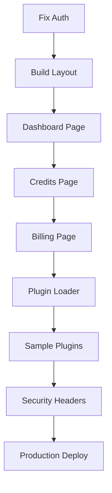

# CRAV Unified Dashboard - Implementation Plan

## Current Status
- ✅ Next.js 15 backend infrastructure complete
- ✅ All API routes functional (12+ endpoints)
- ✅ Database schema with 30+ models
- ✅ Prisma client configured
- ✅ Basic auth setup
- ✅ Build working successfully

## Implementation Priority (MVP First)

### Phase 1: Core UI Infrastructure (IMMEDIATE)
**Goal**: Get functional pages with real data

1. **shadcn/ui Setup** ✅ Started
   - Button, Card components created
   - Install remaining: Input, Select, Dialog, Table, Toast

2. **Global Layout**
   ```
   app/
   ├── layout.tsx (root with providers)
   ├── (dashboard)/
   │   ├── layout.tsx (sidebar + topbar)
   │   ├── dashboard/page.tsx
   │   ├── credits/page.tsx
   │   ├── billing/page.tsx
   │   ├── apps/page.tsx
   │   └── settings/page.tsx
   ```

3. **Auth Flow Completion**
   - Fix middleware to properly check auth
   - Restore session checks in pages
   - Build invite system UI

### Phase 2: Credits & Billing (CORE VALUE)
**Goal**: Users can see balance, spend credits, top up

4. **Credits Page**
   - Balance card (top)
   - Ledger table with filters
   - CSV export button
   - Real-time balance updates

5. **Billing Page**
   - Current plan display
   - Stripe checkout button
   - Invoices table
   - Webhook events viewer

### Phase 3: Plugin System (DIFFERENTIATOR)
**Goal**: Plugins can be installed and used

6. **Apps Marketplace**
   - List available apps
   - Install/uninstall flow
   - Permissions consent

7. **Plugin Loader**
   - Dynamic import for `/apps/[appId]`
   - Error boundaries
   - SDK implementation

8. **Sample Plugins**
   - Geo Quick working
   - Fast Math working
   - Both call spend() correctly

### Phase 4: Polish & Production
**Goal**: Production-ready deployment

9. **Security**
   - CSP headers
   - Rate limiting active
   - Audit log UI

10. **Performance**
    - Image optimization
    - Code splitting
    - Caching strategy

11. **Testing**
    - Critical path E2E tests
    - Integration tests for spend/billing

12. **Deployment**
    - Systemd service
    - Nginx config
    - Health check endpoint

## What to Skip for MVP

### Defer to Post-MVP
- **Observability**: OpenTelemetry, detailed metrics (use simple logging)
- **Advanced A11y**: Focus on semantic HTML first, full WCAG 2.2 later
- **I18N**: English only for MVP
- **Auto-recharge**: Manual top-up sufficient initially
- **Advanced plugin features**: Server hooks, complex permissions
- **Extensive test coverage**: Focus on critical paths
- **Blue/Green deployment**: Simple restart acceptable
- **Tamper-proof ledger**: Hash chain nice-to-have

### Simplified Versions
- **Newsletter**: Store URL only, no RSS parsing initially
- **Asset Upload**: Local storage first, move to Supabase Storage later
- **Webhook Viewer**: Read-only table, manual retry can wait
- **Developer Portal**: Manifest validation only, no complex UI
- **Member Management**: Basic invite/remove, detailed permissions later

## Critical Path to Working App



### Week 1: Foundation
- Day 1-2: Complete UI components, layout, navigation
- Day 3-4: Auth working end-to-end with RBAC
- Day 5: Dashboard and Credits pages functional

### Week 2: Value Delivery
- Day 6-7: Billing integration (Stripe flows)
- Day 8-9: Plugin system and loader
- Day 10: Sample plugins working

### Week 3: Production
- Day 11-12: Security hardening
- Day 13-14: Testing critical paths
- Day 15: Deployment and smoke tests

## File Structure (Target)

```
crav-unified-dashboard/
├── app/
│   ├── (auth)/
│   │   ├── signin/page.tsx
│   │   └── verify/page.tsx
│   ├── (dashboard)/
│   │   ├── layout.tsx (sidebar)
│   │   ├── dashboard/page.tsx
│   │   ├── credits/page.tsx
│   │   ├── billing/page.tsx
│   │   ├── apps/
│   │   │   ├── page.tsx (catalog)
│   │   │   └── [appId]/page.tsx (loader)
│   │   ├── assets/page.tsx
│   │   └── settings/page.tsx
│   └── api/ (existing 12+ routes)
├── components/
│   ├── ui/ (shadcn components)
│   ├── dashboard/ (widgets)
│   ├── credits/ (ledger table)
│   ├── billing/ (plan cards)
│   └── plugins/ (loader, SDK)
├── lib/
│   ├── auth.ts ✅
│   ├── prisma.ts ✅
│   ├── rbac.ts ✅
│   ├── stripe.ts ✅
│   ├── utils.ts ✅
│   └── plugin-sdk.ts (new)
└── middleware.ts (fix)
```

## Next Immediate Steps

1. **Create remaining UI components** (2-3 hours)
   - Input, Select, Dialog, Table, Toast
   - DataTable with sorting/filtering

2. **Build dashboard layout** (2 hours)
   - Sidebar navigation
   - Topbar with balance
   - Route grouping

3. **Fix auth flow** (2 hours)
   - Restore middleware auth checks
   - Fix session type issues
   - Test magic link end-to-end

4. **Build Credits page** (3 hours)
   - Fetch ledger data
   - Table with filters
   - CSV export

5. **Build Billing page** (3 hours)
   - Current plan display
   - Stripe checkout button
   - Invoices list

Total: ~15 hours for working MVP

## Success Criteria (MVP)

- [ ] User can sign in with magic link
- [ ] Dashboard shows real balance and transactions
- [ ] Credits page shows ledger with working filters
- [ ] Billing page allows Stripe top-up
- [ ] One plugin (Geo Quick) installs and works
- [ ] Plugin action spends credits correctly
- [ ] Ledger updates after spend
- [ ] Build succeeds without errors
- [ ] App runs in production mode

## Post-MVP Enhancements

### Short Term (1-2 weeks)
- Full RBAC UI (member management)
- Webhook event viewer with retry
- Assets upload (Supabase Storage)
- Second plugin (Fast Math)
- Basic E2E tests

### Medium Term (1 month)
- Developer portal for publishing
- Auto-recharge configuration
- PayPal integration UI
- Audit log viewer
- Performance optimizations

### Long Term (2-3 months)
- Full observability stack
- Comprehensive test suite
- Advanced plugin features
- I18N support
- Mobile app

## Resources Needed

### Environment Variables (Required for MVP)
```bash
DATABASE_URL=          # Supabase connection
NEXTAUTH_URL=         # App URL
NEXTAUTH_SECRET=      # Generated secret
EMAIL_SERVER=         # SMTP for magic links
STRIPE_SECRET_KEY=    # Stripe API key
STRIPE_WEBHOOK_SECRET= # Stripe webhook secret
```

### External Services
- Supabase (database) ✅ Available
- SMTP service (SendGrid/Postmark)
- Stripe account (test mode)
- (Optional) PayPal sandbox

### Development
- Node 18+
- PostgreSQL client
- Stripe CLI for webhook testing

## Risk Mitigation

### Technical Risks
1. **NextAuth v5 complexity** → Use simpler JWT session, defer advanced features
2. **Plugin isolation** → Use error boundaries, don't overcomplicate
3. **Stripe integration** → Start with one-time checkout, add subscriptions later
4. **Performance** → Focus on caching, defer observability stack

### Schedule Risks
1. **Scope creep** → Stick to MVP checklist, defer everything else
2. **Auth issues** → Allocate extra time, it's critical path
3. **Plugin complexity** → Start with static import, make dynamic later

## Conclusion

**Current state**: Strong backend foundation, basic frontend structure
**MVP target**: 15 hours of focused implementation
**Production target**: 3 weeks with testing and deployment

The spec is comprehensive and excellent for the final product. This plan gets us to a working, valuable application quickly, then iterates toward the full vision.

**Next action**: Create remaining UI components and build the dashboard layout.
